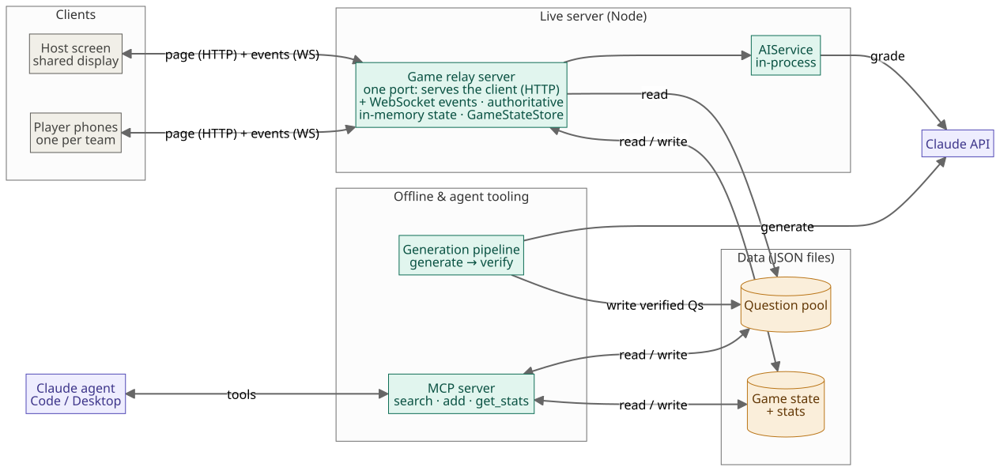

<header class="hero" id="top">
  
Case study · A private repo, shown by its process · July 2026

  <h1>Spec first, ship fast: building Pizza with Claude Code</h1>
  

    Pizza is a multiplayer, AI-hosted party-game platform — one shared screen, every player's phone
    is the controller. This is the build log of its v0.1: <strong>fourteen days from an empty repo to a
    deployed, live-demoed MVP</strong>, built pair-style with Claude Code on a foundation of thirteen
    architecture decision records, a sixteen-issue ordered backlog, and a test suite that grew from
    54 to 166 along the way.
  

  

    

14

days to MVP

    

13

ADRs · 9 pre-code

    

30

pull requests

    

166

tests · node:test

    

8.4k

lines of strict TS

    

1

live demo box

  

  
This page is set in Pizza's own design tokens (docs/ui-spec.md) — the case study wears the product.

</header>

The product

## A game platform that happens to start with trivia

The Jackbox model: a host opens a room on the big screen, a QR code and a four-letter room code appear, and everyone joins from their own phone — no app, no accounts, no install. The server is a Node WebSocket relay and the single source of truth; clients render state and emit input, nothing more.

The deliberate twist is in the name of the repo: **Pizza is the platform, trivia is a module**. The platform core never knows which game it is serving — game rounds cross the wire as opaque payloads owned by the module. And although the product is "AI-hosted," **v0.1 contains zero AI on purpose**: the roadmap introduces one concern at a time — a deterministic game loop first, Claude calling *in* via a custom MCP server at v0.3, the app calling *out* for AI grading at v0.4.

  

    

      
PIZZA trivia<i></i>live

      

        
Scan to join — or enter the code

        

          
<canvas width="25" height="25"></canvas>

          
PVPE

        

        

          <i></i>Ada<i></i>Bex<i></i>Prajno
        

        
3 players in

        
Start game

      

    

    

      
PIZZA trivia<i></i>live

      
Round 1 <b>116</b>

      
What is the capital of France?

      

        
AParis

        
BBerlin

        
CMadrid

        
DRome

      

    

    

      
PIZZA trivia<i></i>live

      
Round 1 <b>78</b>

      
What is the capital of France?

      

        
AParis

        
BBerlin

        
CMadrid

        
DRome

      

    

    

      
PIZZA trivia<i></i>live

      
ROUND 1 · THE ANSWER IS

      

        
AParis

        
BBerlin

        
CMadrid

        
DRome

      

      
<b>2</b> correct&nbsp;&nbsp;<b>1</b> missed

    

    

      
PIZZA trivia<i></i>live

      
FINAL RESULTS

      
🏆 <em>Prajno</em> wins

      

        
1Prajno 🥇2

        
2Bex1

        
3Ada0

      

    

  

  

    

      
PIZZA trivia

      
Join the game

      
Get the code from the big screen

      
Room code

      
PVPE

      
Your name

      
Prajno

      
Join

    

    

      
Round 1<b>1:43</b>

      
<i></i>

      
What is the capital of France?

      
AParis

      
BBerlin

      
CMadrid

      
DRome

      
Pick an answer

    

    

      
Round 1<b>1:18</b>

      
<i></i>

      
What is the capital of France?

      
AParis

      
BBerlin

      
CMadrid

      
DRome

      
Lock it in

    

    

      

        
✓

        
Correct!

        
<b>+1</b> point

        
AAnswer:&nbsp;<b>Paris</b>

      

      
Next round starting…

    

    

      

        
🏆

        
You came 1st

        
<b>2</b> points · you won! 🎉

        
Full standings are on the big screen.

      

      
Thanks for playing!

    

  

  <button data-go="0">1 · Lobby</button>
  <button data-go="1">2 · Round</button>
  <button data-go="2">3 · Lock in</button>
  <button data-go="3">4 · Reveal</button>
  <button data-go="4">5 · Winner</button>
  <button id="demoPlay" aria-pressed="true">⏸ pause</button>

  Not a video — a recreation of the real v0.1 screens in the product's own CSS. Every state was
  verified against a live game played while producing this page: the simulated-player bots Ada and
  Bex joined room PVPE over real WebSockets, and lost.

The process

## Fourteen days, in the order it actually happened

The sequence below is reconstructed from the merge history — and the order is the story. Architecture was decided and reviewed as documents before any code existed; every feature landed as a PR closing a pre-specified issue; reviews produced tracked issues rather than vibes; and shipping produced new decisions, recorded as new ADRs.

  

    
Jul 09 · day 1

    <h3>Eight ADRs before a line of code</h3>
    
The repo's second commit is ADR-0001…0008: server authority &amp; answer secrecy, no UI framework, platform-first repo, files over a database, outbound-only connections, a worker-ready bus, gh CLI over a GitHub MCP server, and the platform/game seam.

  

  

    
Jul 10 · day 2

    <h3>The paper foundation, then the first code</h3>
    
CLAUDE.md, PRD, roadmap, and Mermaid diagrams land (ADR-0009); then the scaffold — a runnable <em>empty</em> dev setup; then ADR-0010 (testing strategy) before the first feature. Shared wire contracts follow, plus a written convention: <code>npm run verify</code> green before any PR.

  

  

    
Jul 11 · day 3

    <h3>Server core</h3>
    
Question pool with a validating loader, WebSocket relay bootstrap with typed routing, the <code>GameStateStore</code> interface, and room lifecycle — create, join, rejoin, roster, host-disconnect grace.

  

  

    
Jul 12 · day 4

    <h3>The game exists</h3>
    
The <code>GameModule</code> seam and round engine (with WS tests asserting no <code>answerIndex</code> on the wire from day one), round-end reveal + leaderboard, and a file-backed store with atomic writes.

  

  

    
Jul 13 · day 5

    <h3>Review waves</h3>
    
A multi-agent architecture review lands as two PRs: a same-day hardening pass (two latent bugs, including a process-killing timer exception) and a four-commit batch — tests → flake fix → god-object decomposition → read validation — "so the refactor lands on a hardened, non-flaky suite."

  

  

    
Jul 14 · day 6

    <h3>The seam repair</h3>
    
Building the client bus exposed a trivia-shaped wire protocol — a latent seam violation. ADR-0011 lands with the fix in the same PR: generic round envelopes, modules own <code>record / content / action / reveal</code>, verified by grep.

  

  

    
Jul 15–16 · days 7–8

    <h3>Design before build, then the clients</h3>
    
WS transport with reconnect; then the UI spec + standalone HTML mockups merge at 20:02 — and the host screen implementation follows at 22:56, the player phone the next morning. Design beat code to main by three hours.

  

  

    
Jul 16–17 · days 8–9

    <h3>Solo-testable end to end</h3>
    
One port serves client + WebSocket (a phone needs only a URL); Tailscale Funnel docs; and the simulated-player bot — the E2E harness that plays full games and <em>fails if a correct answer ever leaks early</em>.

  

  

    
Jul 20–21 · days 12–13

    <h3>Ship it</h3>
    
VPS demo deploy: Caddy auto-HTTPS, Basic Auth on the host page, a HOST_SECRET token gating <code>createRoom</code> over the socket (ADR-0012). A pre-merge adversarial review found 7 issues including a blocker that would have failed every deploy.

  

  

    
Jul 23 · two weeks to the day

    <h3>Operate &amp; steer</h3>
    
Milestones reordered by ADR-0013 (platform breadth before AI grading); the reveal-pacing bug found in live play gets fixed; CI runs the same verify gate as local; <code>npm run smoke</code> + <code>/healthz</code>; and Deploy / Ops / Monitor become GitHub Actions.

  

Decisions first

## An immutable decision ledger

Nine ADRs predate all code; ten predate all feature code. Each is four sections — Status, Context, Decision, Consequences — and none has ever been edited to change a decision. A changed mind gets a **new numbered record** that names exactly what it extends or reverses, so the ledger reads chronologically: day-one bets, a mid-build course correction, what shipping changed, and a priority shift — with every earlier rationale preserved verbatim, including the reversed ones.

  
ADR-0001
<strong>Server authority; answer keys never cross the wire.</strong> Any key reaching a client is readable in the network tab — the game becomes cheatable.

  
ADR-0002
<strong>Vanilla TypeScript, no UI framework.</strong> Clients render server state and emit input; a reconciler earns nothing here.

  
ADR-0003
<strong>Platform-first repo; games are modules.</strong> "If code wouldn't serve a hypothetical second game, it's in the wrong folder."

  
ADR-0004
<strong>Files over a database.</strong> JSON at laptop scale, behind a <code>GameStateStore</code> interface so SQLite later is an implementation, not a rewrite.

  
ADR-0005
<strong>Outbound-only WebSockets.</strong> Clients dial out, keyed by a room code; anything needing reachable clients "dies on firewalls."

  
ADR-0006
<strong>RxJS bus behind a worker-ready interface.</strong> Message-passing only, so the future Web Worker move is a swap, not a refactor.

  
ADR-0007
<strong>gh CLI; build our own MCP server instead.</strong> "Consuming someone else's MCP server teaches nothing about designing one."

  
ADR-0008
<strong>A minimal GameModule seam, proven later by a stub.</strong> "Over-generalizing before a second game exists is how you build the wrong abstraction."

  
ADR-0009
<strong>Mermaid diagrams in markdown.</strong> Diagrams diff as text and update in the same PR as the architecture change.

  
ADR-0010
<strong>Test invariants and logic first; a headless bot for E2E.</strong> Browser E2E over a realtime WS loop is the flakiest layer — "not where the risk lives."

  
ADR-0011
<strong>Generic round protocol.</strong> Written mid-build when trivia types leaked into the wire; modules now own round payloads, opaque to the platform.

  
ADR-0012
<strong>Demo VPS with layered access control.</strong> The privileged action to gate isn't the host <em>page</em> — it's <code>createRoom</code> over the socket.

  
ADR-0013
<strong>Reorder milestones: platform before AI.</strong> A pure scheduling ADR that openly reverses ADR-0008's timing — "the one reversal of stated reasoning, made deliberately."

<blockquote class="pull">
  
"The immutable ADRs keep their original numbers on purpose. Per the ADR-immutability rule, they are not edited; this ADR is the single source of truth for the remap."

  <cite>ADR-0013 — changing the plan without rewriting history</cite>
</blockquote>

The unit of work

## Issues you can hand to an agent

Every feature is one GitHub issue with the same five-part shape — and the shape is what makes AI-paired development controllable: **Context** cites the ADRs, **Goal** is one sentence, **Acceptance criteria** are checkable (often literally executable), **Out of scope** names where each deferral lands, and **Notes for Claude** speaks directly to the pair programmer.

  

    #8
    Round engine + GameModule seam: serve wire payload, collect, MC-score, advance
    featarea: platformmilestone: v0.1
  

  <dl>
    <dt>Acceptance criteria (abridged)</dt>
    <dd><ul>
      <li>✓ An automated test asserts <strong>no answer field appears on any client-bound payload</strong> produced by the loop (ADR-0001) — promote the informal "check" to a real test.</li>
      <li>✓ A WS-level integration test drives a full round over a real socket.</li>
    </ul></dd>
    <dt>Out of scope</dt>
    <dd>Reveal / leaderboard broadcast — that's #9. Free-text scoring — v0.4.</dd>
    <dt>Notes for Claude</dt>
    <dd>"This is the biggest issue in the batch — <strong>if it gets unwieldy, split the GameModule interface into its own tiny PR first</strong>, then the loop."</dd>
  </dl>

  

    Bugs become issues
    
#52 opens: <em>"Found during #15's live end-to-end run."</em> The reveal rendered for one frame before the leaderboard — "the quiz-show money moment never lands." Filed with a fix sketch and a written justification for deferring; fixed on day 14.

  

  

    Ideas get parked, not built
    
#29 (host accounts) is stamped <em>"Status: post-MVP — captured, not scheduled."</em> Accounts are a PRD non-goal, so step 1 would be a superseding ADR. #54 and #55 are fully specified future features left deliberately open.

  

  

    Honest division of labor
    
#21's CI checklist tags one item <code>[Manual, Praj]</code> — enabling branch protection is a repo setting, "not doable from code." The human work is in the spec too.

  

Architecture

## Diagrams that live in the repo

Per ADR-0009, every diagram is Mermaid in markdown — one per file, reviewed in the same PR as the change it depicts. These four are pre-rendered from the repo's own sources.

.")

, and even the lobby view carries no keys: secrecy starts at join, not at round start.")

.")

The invariant

## Cheating is a compile error

The headline engineering idea: answer secrecy isn't a code-review guideline, it's **structural**. The server-only `QuestionRecord` carries the key; the client-bound `QuestionWire` declares the key's field as `never`, so a record is not even *assignable* to the wire type — and `toWire()` is the only sanctioned projection between them.

<pre class="code">// src/games/trivia/question.ts — the wire type cannot carry the key
export interface QuestionWire {
  readonly id: QuestionId;
  readonly category: string;
  readonly difficulty: Difficulty;
  readonly prompt: string;
  readonly options: readonly string[];
  readonly answerIndex?: never;
}

export function toWire(record: QuestionRecord): QuestionWire {
  const { id, category, difficulty, prompt, options } = record;
  return { id, category, difficulty, prompt, options };
}</pre>

And the guard guards itself. The test suite uses `@ts-expect-error` as a compile-time regression test: if the `never` protection ever weakens, these directives become unused and `npm run typecheck` fails.

<pre class="code">// src/games/trivia/question.test.ts — a test that runs in the type system
test('a QuestionWire cannot carry the answer key (compile-time)', () => {
  // @ts-expect-error — a full record (with answerIndex) is not assignable to a wire.
  const fromRecord: QuestionWire = record;
  // @ts-expect-error — answerIndex cannot be added to a wire object.
  const smuggled: QuestionWire = { ...toWire(record), answerIndex: 0 };
  assert.ok(fromRecord &amp;&amp; smuggled);
});</pre>

The same invariant is then enforced at four independent layers — colored here like the game's own answer identities:

  
A · Compile time
The <code>never</code>-typed field plus <code>@ts-expect-error</code> regression tests. Branded nominal ids (<code>Brand&lt;T, B&gt;</code> via a <code>unique symbol</code>) keep a <code>RoomCode</code> from ever standing in for a <code>PlayerId</code> — zero runtime cost.

  
B · Unit &amp; module tests
"toWire strips the answer key" and "contentFor strips the answer key (ADR-0001)" — the projection functions are tested directly, at both the trivia edge and the module seam.

  
C · Wire integration
WS tests drive a full 3-question game over real sockets and assert <code>Object.hasOwn(wire, 'answerIndex') === false</code> on live frames — the reveal exists in exactly one message, <code>roundResult</code>.

  
D · The bot, in production
The simulated-player bot deep-scans every pre-reveal frame for four spellings of the key and exits non-zero on a leak — locally in <code>npm run smoke</code>, and against the <em>live</em> box after every deploy.

### The seam that got repaired in public

The platform/game boundary got its own stress test on day 6. Building the client bus exposed that the wire protocol was trivia-shaped and the "game-agnostic" round engine was reading `answerIndex` directly — a latent violation of the seam ADR. The response is the pattern worth showcasing: stop, write ADR-0011, and land the repair *with* the decision in one PR — generic envelopes, module-owned payloads, trivia types relocated out of shared code, and the diff verified by grep: *"no game type or wire field survives in src/shared | server | platform | client."*

<pre class="code">// src/shared/messages.ts — the platform relays payloads it cannot read
export type ServerMessage&lt;Content = unknown, Reveal = unknown&gt; =
  | { readonly type: 'roundStarted'; readonly roundIndex: number;
      readonly content: Content; readonly deadline: number }
  | { readonly type: 'roundResult';  readonly roundIndex: number;
      readonly results: readonly PlayerRoundResult[]; readonly reveal: Reveal }
  // … the reveal exists in exactly one message, by construction</pre>

<blockquote class="pull">
  
"Left in place, every client would be built against a trivia-shaped protocol, cementing the leak exactly where it is most expensive to undo. […] The lint rule that forbids the platform from importing <code>src/games/*</code> now has nothing to hide."

  <cite>ADR-0011 — generic round protocol, written mid-build</cite>
</blockquote>

The proof that the platform is genuinely generic is also a test: the room lifecycle runs against a `StubGameModule` with deliberately non-trivia payload types.

Design

## The mockups merged three hours before the code

Before either client screen was built, issue #46 produced a UI spec and two standalone HTML mockup galleries — checked into the repo, openable by double-click, covering **every state including the edges**: 6 host frames and 11 phone frames, join errors and reconnect banners included. The commit log is the receipt: spec and mockups merged at 20:02 on July 15; the host screen landed at 22:56; the player phone at 00:08. Because the mockups used the exact design tokens of the planned app, "the CSS ports directly" — a head start, not throwaway.

  <i style="background:#141021"></i>--ground
  <i style="background:#ff3d81"></i>--brand
  <i style="background:#17c0c9"></i>--opt-a
  <i style="background:#3e7bfa"></i>--opt-b
  <i style="background:#9b6bf5"></i>--opt-c
  <i style="background:#f9a63a"></i>--opt-d
  <i style="background:#37d67a"></i>--correct
  <i style="background:#ff5470"></i>--wrong

The system is "quiz-show broadcast": a chosen plum-ink ground (not flat black), one magenta accent spent sparingly, and four **colour + letter** answer identities that match across host and phone — so "I picked the teal one, B" reads across a room. The letter is the primary channel, which makes the coding colourblind-safe; sans-vs-mono *is* the type system (mono for machine values, sans for prose); dark is primary, light fully designed.

<blockquote class="pull">
  
"Semantic green/red appear only as a ring, badge, or check — never as a card fill — so they never collide with an option's identity colour. At reveal, the correct card keeps its own colour and gains a green ring + check; the others dim."

  <cite>docs/ui-spec.md — the colour rule</cite>
</blockquote>

Even secrecy shows up in the design layer: the host's mid-round view renders a payload that structurally contains no key, so *"the host structurally cannot show an answer mid-round."* And each mockup ends with a "Decisions I made — and the open questions for you" panel; the spec's decision table records the product owner's ✓ on each call and one explicit ✗ (per-answer vote counts — not in the wire payload, not MVP).

Quality loop

## Reviews that produce commits, tests that guard themselves

Quality ran as a loop, not a phase. A multi-agent architecture review on day 5 split its findings by cost: the cheap, high-value fixes shipped the same day as a hardening pass — including two latent bugs, one of which (an uncaught exception inside a `setTimeout` tick) would have taken *every room in the process* down. The bigger findings became tracked issues, landing next as four independently-green commits ordered *tests → flake fix → refactor → validation*, "so the refactor lands on a hardened, non-flaky suite."

  

    The gate can't drift
    
<code>npm run verify</code> = typecheck + lint + test + build, green before any PR. CI runs <em>the same four npm scripts</em> on every PR to main — same commands, so local and CI are one gate by construction.

  

  

    Flakes are bugs
    
Sleep-as-synchronization was systematically replaced with awaited signals — tests wait for the actual <code>roomClosed</code> or <code>gameOver</code> frame, with timeouts. "Ran the suite 3× clean" is in the PR body.

  

  

    Test the checker
    
The bot's answer-leak scanner is itself unit-tested — it provably catches a planted <code>answerIndex</code> — and its pass rule has a <code>seatedPlayers &gt; 0</code> backstop against green-while-nothing-ran.

  

  <h3>Tests across the v0.1 pull requests</h3>
  
npm test count reported in each PR body · node:test, zero test-framework dependencies

  <svg viewBox="0 0 660 230" role="img" aria-label="Line chart: test count grows from 54 at PR 30 to 164 at PR 63">
    <g stroke="var(--hairline)" stroke-width="1">
      <line x1="52" y1="180" x2="640" y2="180"/>
      <line x1="52" y1="120" x2="640" y2="120"/>
      <line x1="52" y1="60" x2="640" y2="60"/>
    </g>
    <g fill="var(--muted)" font-family="ui-monospace, Menlo, monospace" font-size="11">
      <text x="44" y="184" text-anchor="end">0</text>
      <text x="44" y="124" text-anchor="end">80</text>
      <text x="44" y="64" text-anchor="end">160</text>
    </g>
    <polyline points="80,139.5 170,130.5 260,120.75 350,116.25 440,87 530,58.5 620,57" fill="none" stroke="var(--brand)" stroke-width="2.5" stroke-linejoin="round" stroke-linecap="round"/>
    <g fill="var(--brand)" stroke="var(--surface)" stroke-width="2">
      <circle cx="80" cy="139.5" r="4.5"><title>PR #30 · round engine — 54 tests</title></circle>
      <circle cx="170" cy="130.5" r="4.5"><title>PR #33 · hardening pass — 66 tests</title></circle>
      <circle cx="260" cy="120.75" r="4.5"><title>PR #38 · review batch — 79 tests</title></circle>
      <circle cx="350" cy="116.25" r="4.5"><title>PR #43 · generic protocol — 85 tests</title></circle>
      <circle cx="440" cy="87" r="4.5"><title>PR #47 · UI spec — 124 tests</title></circle>
      <circle cx="530" cy="58.5" r="4.5"><title>PR #59 · demo deploy — 162 tests</title></circle>
      <circle cx="620" cy="57" r="4.5"><title>PR #63 · CI gate — 164 tests</title></circle>
    </g>
    <g fill="var(--text)" font-family="ui-monospace, Menlo, monospace" font-size="12" font-weight="700">
      <text x="80" y="128" text-anchor="middle">54</text>
      <text x="620" y="45" text-anchor="middle">164</text>
    </g>
    <g fill="var(--muted)" font-family="ui-monospace, Menlo, monospace" font-size="11">
      <text x="80" y="202" text-anchor="middle">#30</text>
      <text x="170" y="202" text-anchor="middle">#33</text>
      <text x="260" y="202" text-anchor="middle">#38</text>
      <text x="350" y="202" text-anchor="middle">#43</text>
      <text x="440" y="202" text-anchor="middle">#47</text>
      <text x="530" y="202" text-anchor="middle">#59</text>
      <text x="620" y="202" text-anchor="middle">#63</text>
      <text x="346" y="222" text-anchor="middle">pull request</text>
    </g>
  </svg>
  

    
View as table

    <table>
      <tr><th>PR</th><td>#30</td><td>#33</td><td>#38</td><td>#43</td><td>#47</td><td>#59</td><td>#63</td></tr>
      <tr><th>tests</th><td>54</td><td>66</td><td>79</td><td>85</td><td>124</td><td>162</td><td>164</td></tr>
    </table>
  

The last ring of the loop is the smoke: `npm run smoke` boots the *built artifact* (`dist/main.js`), waits on `/healthz`, and has the bot play a full 3-player game with a mid-game reconnect — asserting the round loop *and* answer secrecy on the thing that actually ships, not just in-process tests.

Ship &amp; operate

## A one-person devops loop with no laptop required

The deploy story keeps the architecture honest: ADR-0012 frames the VPS as "a remote always-on laptop" — clients still dial out, state is still files (which finally gain a durable disk). The security insight is where to put the gate: not on loading the host *page*, but on `createRoom` *over the WebSocket*, which a scripted socket could otherwise hit. Basic Auth guards the page; a `HOST_SECRET` token — injected only into the authenticated page — guards the privileged action; guests need only a room code.

  

    Deploy · a deliberate click
    
Manual-dispatch only — "never auto-deploys on merge." The <code>ref</code> input means <em>deploying an older ref is the rollback</em>. After rsync + build + restart, <code>verify-live.sh</code> has the bot play a full game against the live <code>wss://</code> endpoint — a broken deploy fails the release on a product invariant, not just a ping.

  

  

    Ops · least privilege
    
CI connects as a non-root <code>deploy</code> user: owns <code>/opt/pizza</code>, passwordless sudo for <em>exactly one command</em> (<code>systemctl restart pizza</code>), reads logs via group, cannot read the secrets file. The app itself runs in a hardened systemd sandbox (<code>ProtectSystem=strict</code>, nologin user).

  

  

    Monitor · zero side effects
    
A 15-minute cron curls <code>/healthz</code> — no SSH, no secrets, and deliberately <em>no bot</em>, "so nothing accumulates in the state store." The same probe the smoke and the deploy verification already use.

  

Underneath it all is one zero-config property: the client always dials `ws(s)://` on the page's own origin — nothing hardcoded — which is why localhost, LAN, Tailscale Funnel, and the Caddy-fronted VPS all run the identical build.

<blockquote class="pull">
  
"Sourcing (<code>. env</code>) would parameter-expand the values, and a bcrypt hash is full of <code>$</code> sequences — under <code>set -u</code> that aborts outright, and otherwise it silently mangles the hash. So read KEY=VALUE literally."

  <cite>deploy/setup.sh — the kind of comment a pre-merge adversarial review leaves behind; this exact bug was the blocker that "would have failed 100%" of documented deploys, caught before anyone ran it</cite>
</blockquote>

The playbook

## What made the AI pairing work

None of the above required heroics — it required a repeatable working agreement between a developer and an agent. These are the practices this repo actually demonstrates, each with its receipt.

  
<h3>◆Write the constitution before the code</h3>
Eight ADRs were the repo's second commit; CLAUDE.md turns them into standing orders ("YOU MUST NOT break these") every session inherits. The agent never has to guess the architecture — it's written down, with the why.

  
<h3>◆The repo is the memory</h3>
PRD, roadmap, ADRs, diagrams, specs — all in-repo, reviewable, and loadable on demand. Issues stay short because they reference ADRs for rationale. Any decision that would otherwise live in a chat gets written down.

  
<h3>◆One issue at a time, specified to be checkable</h3>
Context → Goal → Acceptance criteria → Out of scope → <em>Notes for Claude</em>. Criteria are often literally executable ("an automated test asserts…"). Underspecified? The rule is stop and ask, not guess.

  
<h3>◆Make invariants structural — then test them anyway</h3>
The answer key is unrepresentable on the wire type, the seam is lint-enforced, and both are <em>still</em> covered by unit, integration, and live-bot checks. Belt, suspenders, and a bot pulling on the trousers.

  
<h3>◆Green before PR; CI is the same command</h3>
<code>npm run verify</code> locally, the identical four scripts in CI — a visible command, deliberately not a hidden pre-commit hook. Every PR body reports the gate green with the test count.

  
<h3>◆Review adversarially, in waves</h3>
Multi-agent architecture reviews found real bugs (a process-killing exception; a deploy that would have failed 100%). Cheap fixes ship immediately; expensive ones become tracked issues. Findings land in PR bodies and issues — repo-as-memory again.

  
<h3>◆Bugs become issues, even mid-session</h3>
"Found during #15's live end-to-end run" is the first line of a bug report, not a silent hotfix. The grace-timer gap (#27) and the reveal pacing (#52) both got specs, tests, and their own PRs.

  
<h3>◆Park ideas with full specs; change plans with new ADRs</h3>
Host accounts, host-paced rounds, the module registry — fully specified, deliberately unbuilt. When priorities really changed, ADR-0013 reordered milestones without editing history, naming the one piece of reasoning it reverses.

  
<h3>◆Design lands before implementation</h3>
UI spec + every-state mockups merged three hours before the first client screen, in the app's exact tokens — so implementation was a port, not an improvisation, and product decisions (✓/✗) were on record first.

  
<h3>◆Prove it end to end with no humans in the room</h3>
The definition of done was "a full game, solo": a simulated-player bot that joins, plays, reconnects, and polices secrecy — reused as the local smoke, the manual checklist, and the post-deploy verification against production.

What's next

## AI enters one concern at a time

v0.1 proved the loop with zero AI. The reordered roadmap (ADR-0013) now goes breadth-first: **v0.2** — polish, reconnection robustness, and a deliberately thin second game module to prove the seam with a real consumer; **v0.3** — Claude calls *in*: a custom MCP server over the question pool (`search_questions`, `add_verified_question`, `get_game_stats`) plus a generate→verify content pipeline; **v0.4** — the app calls *out*: free-text questions graded live by Claude, where answers travel up and the key still never travels down. The parked issues — host accounts, host-paced rounds, the module registry, Docker — are already specified and waiting their turn.

<footer class="article-foot">
  

    Produced with Claude Code from the repository's own history — commits, ADRs, issue and PR bodies —
    with every screen re-verified against a live game during production. The Pizza repo is private, so
    artifacts are referenced by number rather than linked. Type is intentionally system sans + mono, per
    the product's own spec (no webfonts is a decision here, not an omission). Diagrams are pre-rendered
    from the repo's Mermaid sources, unmodified.
  

</footer>
