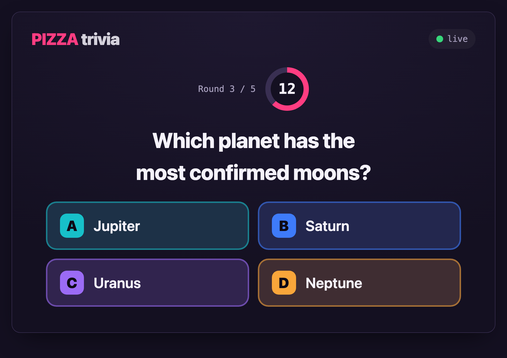
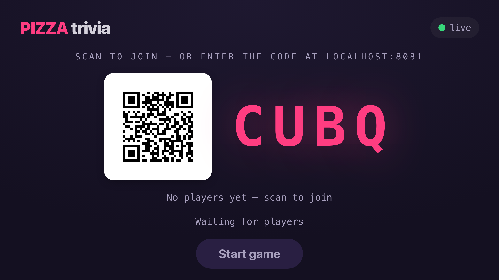
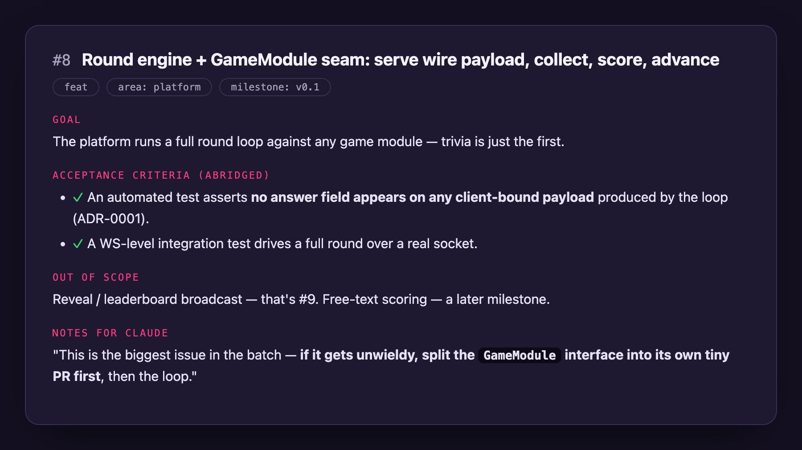
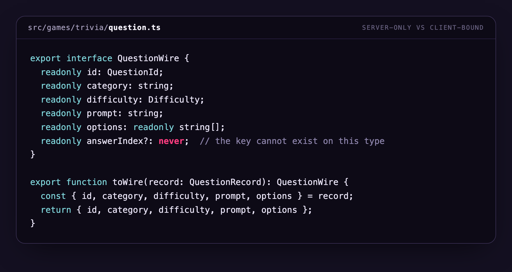
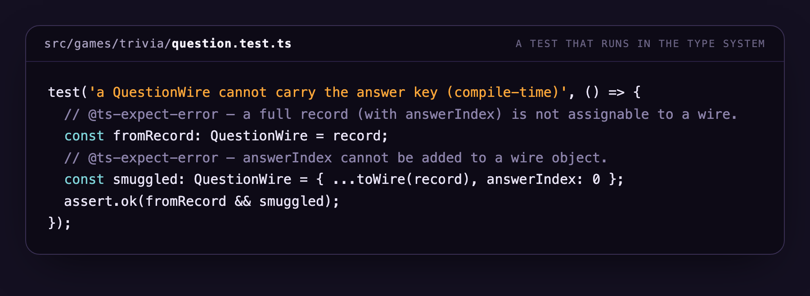
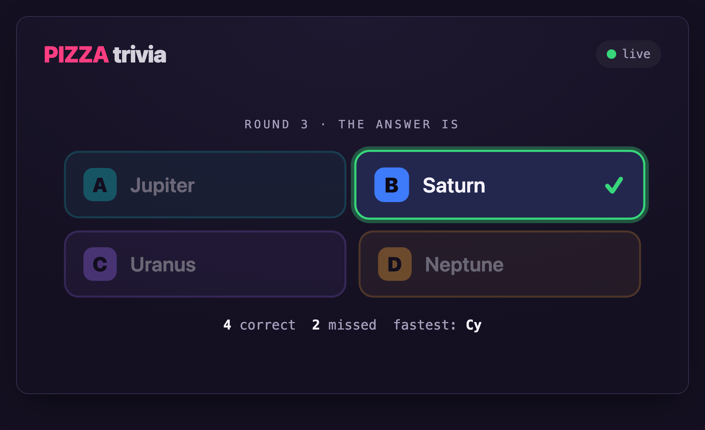

For two weeks I built a side project with Claude Code and deliberately wrote none of the code by hand. My job was everything around the code: decisions, specifications, reviews, and the occasional veto. Claude's job was the typing.

The intent was simple: have some fun, learn what AI-agent development actually feels like beyond autocomplete, and build something real from an empty repository. I set ground rules before starting — MVP scope only, and simplicity first: vanilla TypeScript in strict mode, no frameworks, JSON files instead of a database, WebSockets and the DOM. Every one of those constraints was written down before any code existed.

The something real is **Pizza**: a zero-install multiplayer game platform. The game runs on one shared screen; players join from their phones via QR code or a four-letter room code — no app, no accounts, no install. Trivia is the first game module, but the platform core is game-agnostic: it hosts rounds and relays payloads it can't even read. And although the long-term plan is an AI-hosted game night, version 0.1 contains *zero* AI on purpose — the roadmap introduces one new concern per milestone, and the first milestone was proving the whole loop deterministically.

Fourteen days after the first commit, the MVP was live on a small VPS behind HTTPS — with CI, one-click deploys, and a simulated-player bot that verifies every release by playing a full game against production. Along the way: 13 architecture decision records, around 30 pull requests, and a test suite that ended at 166 tests.

## Decisions before code

The repository's second commit contains no code at all. It's eight Architecture Decision Records — short documents, each with four sections: Status, Context, Decision, Consequences. Server-authoritative state with answers never sent to clients early. No UI framework. A platform-first repo where games are plug-in modules. Files over a database. Clients always dial out, so nothing ever needs to reach a phone through a firewall. By ship day there were thirteen.

Two rules made these records powerful. First, they're **immutable**: changing your mind means writing a *new* ADR that names exactly what it supersedes, so the reasoning trail never rewrites itself. When I reordered two milestones late in the project, that was its own ADR — one that openly reverses an argument an earlier ADR had made. Second, the ADRs are distilled into the repo's CLAUDE.md file — the standing orders every Claude Code session picks up automatically, with the invariants marked as non-negotiable.

This is the single biggest accelerator I found. An agent with the architecture written down doesn't guess, doesn't drift, and doesn't re-litigate settled questions at 11pm. We spent day one arguing about design, and after that, arguments had to be won in writing — as new ADRs.

> "Over-generalizing before a second game exists is how you build the wrong abstraction." — ADR-0008

## Specs an agent can be handed

All work went through GitHub issues — sixteen seeded up front for v0.1, ordered so nothing builds on an unbuilt foundation. Every issue has the same five-part shape: **Context** (with ADR references), a one-sentence **Goal**, checkable **Acceptance criteria**, an explicit **Out of scope** list, and a section literally titled **Notes for Claude**, addressed to the pair programmer.

The detail that matters: acceptance criteria are written as things a machine can verify — "an automated test asserts no answer field appears on any client-bound payload" is a spec you can't argue with. Out-of-scope lines name which future issue owns each deferral, which is how a fun side project resists becoming an unshippable one. And the working agreement had one more rule that saved us repeatedly: if an issue turns out to be underspecified, *stop and ask* — never guess.

The same discipline ran in reverse, too. Bugs found during live play became issues instead of silent fixes. Feature ideas got captured as fully-specified issues and deliberately *not built*. The backlog is where scope creep went to wait its turn.

## Make cheating a compile error

A trivia game dies the moment the answer key reaches a phone before the reveal — anyone can open a network tab. So the core invariant isn't a code-review guideline; it's in the type system. The server-side question record carries the answer. The client-bound type declares that field with TypeScript's `never`, which makes it unrepresentable — a record is not even assignable to the wire type, and one small function is the only sanctioned way to produce a client payload.

Then the guard guards itself. The test suite uses `@ts-expect-error` as a compile-time regression test: if the protection ever weakens, those directives become unused and the typecheck fails.

The same invariant is re-checked at every layer above: unit tests on the projection functions, and integration tests that drive full games over real WebSockets and inspect the actual frames for the key. The whole suite runs on Node's built-in test runner — no test framework dependency at all — and tests were never a follow-up task: every issue's acceptance criteria included them, so they shipped in the same pull request as the feature.

## A bot instead of a browser test suite

The conventional move for end-to-end testing is a browser automation suite. We wrote an ADR rejecting that for the MVP: browser tests over a real-time WebSocket loop are the flakiest, most expensive layer you can build, and the risk wasn't in the DOM — it was in the game loop and the protocol. Instead, Claude built a simulated-player bot: it joins a room over real WebSockets, fields a team of fake players, answers questions, drops a player mid-game to prove reconnection keeps seat and score, and — because a bot can't know the answers — scans every message it receives before the reveal and fails the run if the answer key ever leaks.

One command, `npm run smoke`, boots the actual build artifact, waits for a health check, and has the bot play a full game against it. That was the MVP's definition of done, straight from the PRD: a complete game, solo — no other humans in the room.

. Bex remains the strongest random guesser I know.")

## Ship like you mean it

Quality gates only work if they can't drift. Locally, one command — typecheck, lint, test, build — had to be green before any pull request; CI runs the *same four npm scripts* on every PR, so the local gate and the merge gate are one gate by construction.

Deployment is a GitHub Actions workflow with a manual button: every ship is a deliberate click, never a side effect of merging. The workflow takes a git ref as input, which means rolling back is just deploying an older ref — no extra machinery. And after every deploy, the same simulated-player bot plays a full game against the *production* server over TLS. A release doesn't count as shipped because the process started; it counts because a bot just played a game on it and confirmed the answers didn't leak.

## What I'd keep

Fourteen days for all of the above is quicker than I've ever gotten a side project to "done, deployed, and tested." All it took was a working agreement. In order:

- **Write the constitution first.** ADRs before code, distilled into CLAUDE.md. Settled decisions stay settled, and the agent inherits them every session for free.
- **Specs that read like tests.** If an acceptance criterion can be executed, the definition of done is never a debate.
- **Put invariants in the compiler.** "Structurally impossible" beats "carefully reviewed" — and then test it anyway at every layer above.
- **Build the harness that matches your risk.** A protocol-level bot covered the risk that actually mattered — the game loop and the protocol — at a fraction of a browser suite's flake.
- **One gate, everywhere.** The pre-PR command and CI run identical scripts; the smoke bot and the post-deploy check are the same bot.
- **The repo is the shared memory.** Decisions, specs, and diagrams live in files the agent can read, so no session starts from zero and nothing important lives only in a chat log.
- **Park ideas, don't build them.** A fully-specified issue captures the enthusiasm without spending it.

The part that surprised me most: almost everything on that list is just software engineering hygiene, applied a little more literally than usual. Working with an agent didn't demand a new discipline — it rewarded the old ones, immediately and visibly. Documents I might have skipped as a solo developer became the interface that made the collaboration work.

## What's next

Version 0.1 proved the loop with no AI in it. Next, AI arrives one concern at a time: first Claude calling *in* — an MCP server over the question pool, so an agent can search, verify, and add content offline — then the app calling *out*, with free-text questions graded live by Claude. Even then the invariant holds: player answers travel up to be judged; the answer key still never travels down.

The repo stays private for now, so the code lives here as screenshots — but the process is the part worth stealing anyway. If you try something like this, start with the boring documents. They're what buy you the fun ones.

