<header class="hero" id="top">
  
Field notes · the same private repo, the week after platform week · August 2026

  <h1>Two games on the board</h1>
  

    <a href="../pizza-platform-week/">Platform week</a> ended by pointing at v0.3 — the milestone where
    Claude calls <em>in</em>. The week that followed didn't chase it. It cleared the bench instead:
    Battleship went from a server with no client to a game you can actually play, in its own Apple II
    green-phosphor skin; the write-only event spine grew a five-view console that reads itself back; and
    the platform drew a hard line between the chrome it owns and the theme a game brings. That's v0.2's
    real goal — <strong>a second, genuinely playable game</strong> — reached. The version number still
    says 0.1.0.
  

  

    

2

playable games · was 1

    

31

PRs merged · Aug 13–20

    

627

tests · was 463

    

5

admin views · the ops console

    

2

bench items cleared · of 5

    

0.1.0

still no tag

  

  
Set in Battleship's own CRT theme — the one dispatch that doesn't wear the house colors.

</header>

<figure>
  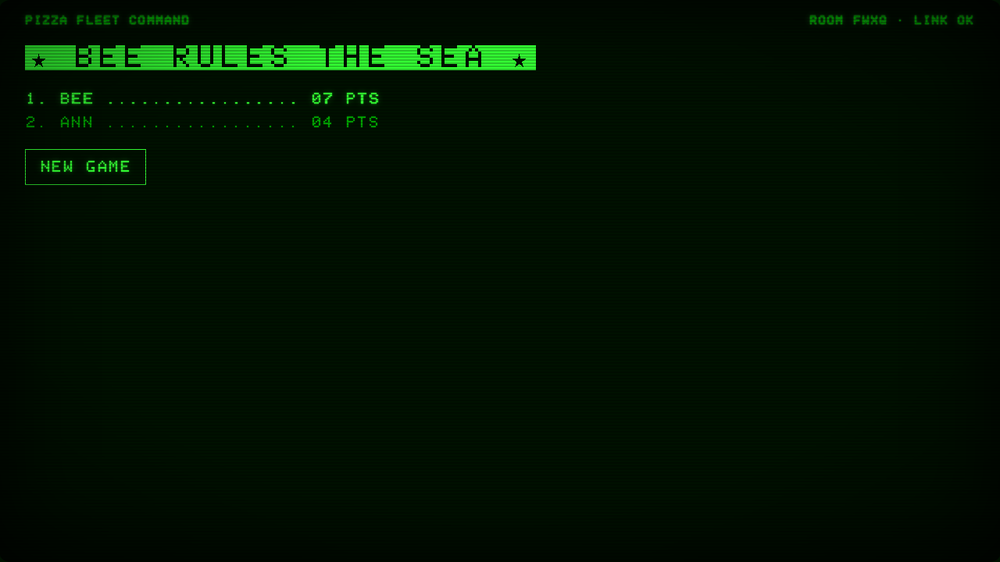
  <figcaption>The second game, played to a finish. Host wall — fleet command, 1982.</figcaption>
</figure>

The week

## Not the shiny thing

The honest shape of the week: it deferred its own headline. v0.3 — an MCP server over the question
pool and a generate-then-verify content pipeline — is still filed, still unwritten, zero code under
`src/`. Every one of the 31 PRs that merged was v0.2 work, and they landed the way stacked work lands:
**31 pull requests consolidated into 12 arrivals on `main`**, two of them umbrella trains that each landed
a whole stack of branches as one — Battleship (#239) and the observability spine (#267).

Two of the five items left on last dispatch's bench got cleared outright: *Battleship has no face*
(#163) and *telemetry is write-only* (#218, #219). Nothing about that is glamorous. It's the week you
finish the things you already started instead of starting the thing you already teased.

Battleship

## A server with a face

Last week Battleship was a server module with wire tests and a README that was mostly a list of what it
wasn't yet. This week it grew both halves of a client and closed #163. It's a real game now — proven by
Playwright driving two phones through placement, volleys, and a finish, with sentinels asserting no ship
glyph ever leaks onto a screen it shouldn't (ADR-0017's per-seat secrecy, checked by machine).

The play arc lives on the phone. Round zero is **the shipyard** — tap to anchor each ship, `LAY` flips it
across or down, `SHUFFLE` throws the whole fleet, `READY` commits; a seat that never commits gets
auto-placed at close, so one AFK admiral never wedges the war. Then it's select-then-`FIRE`, the same
lock-in trivia uses. A single-hue glyph language carries everything: fog is `·`, a miss `○`, a hit a
glowing `✶`, a sunk cell `✶` on inverse video — a burning wreck is the brightest thing on the board.

  <figure class="phone">
    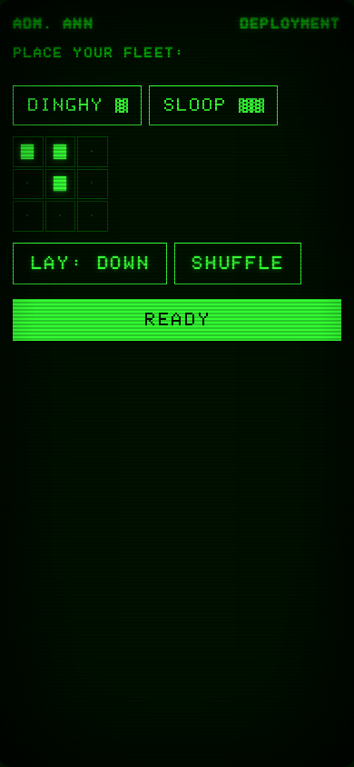
    <figcaption>Deploy — the shipyard.</figcaption>
  </figure>
  <figure class="phone">
    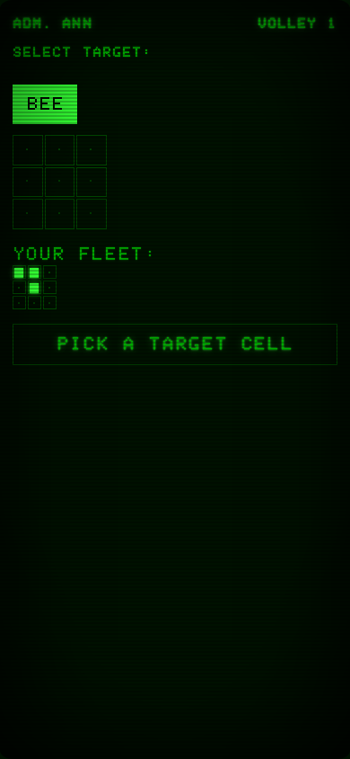
    <figcaption>Target — pick a cell, then fire.</figcaption>
  </figure>
  <figure class="phone">
    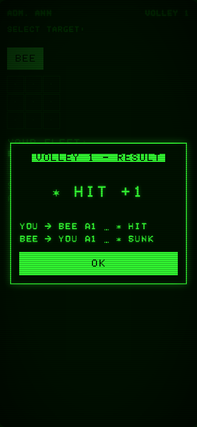
    <figcaption>Resolve — a modal over the live console, not a screen swap.</figcaption>
  </figure>

Two decisions were dragged out of a real playtest, on the record. The result screen used to be a full
swap between every firing — *"disruptive,"* the commit says — so #242 turned it into a modal that rides
over the still-mounted console and auto-dismisses at the next volley; the board you were reading is still
there underneath. And the round timer used to close volleys *"under people mid-thought,"* so #241 gave
Battleship a declared pacing of **none**: a round ends only when every living, connected admiral has
fired. Drop your phone and the war waits for you; there is no countdown to render.

<figure>
  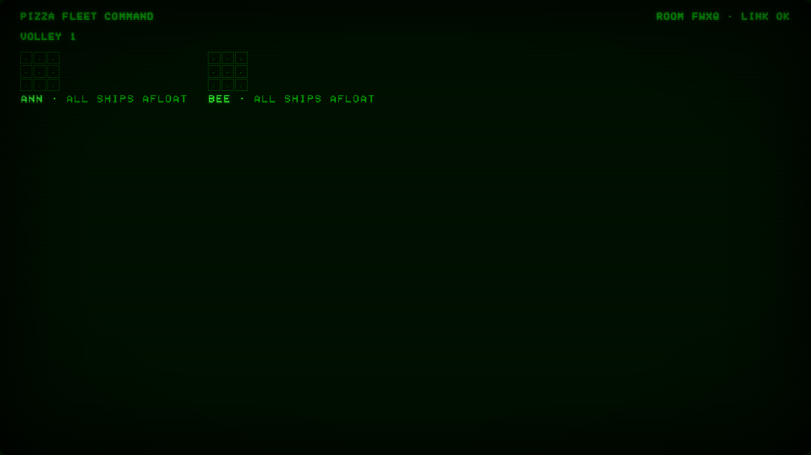
  <figcaption>The wall splits per fleet — party-scale boards, fog of war, both fleets still afloat.</figcaption>
</figure>

<blockquote class="pull">
  
"You win Battleship by outliving, not out-scoring."

  <cite>#235 — the final board ranks by survival order, applied at broadcast and at resync alike, so a reload can never re-rank the war</cite>
</blockquote>

Design

## Where the platform ends and a game begins

Battleship's CRT is nothing like trivia's quiz-show plum, and that forced a question the repo had never
answered on the record: **may a game own a complete visual theme, or must it inherit the platform look?**
ADR-0021 answers yes — and draws the line precisely. It's the section that made *this page* possible: the
dispatch you're reading is set in Battleship's own theme, as proof the seam holds.

  
platform owns
<strong>The chrome before any game mounts.</strong> The game picker, the join shell, the shared tokens. Since the #240 rescope it's deliberately <em>plain</em> — neutral <code>--pf-*</code> tokens, system fonts — until a real landing theme is designed.

  
a game owns
<strong>Every pixel once it mounts.</strong> Its own namespaced tokens (<code>--bs-*</code>), its own self-hosted fonts, even opting out of the platform's light theme — a CRT has no light mode — and its own contrast and motion obligations.

  
the hook
<strong>One mechanism joins the two.</strong> The platform stamps <code>data-game-theme</code> on <code>&lt;html&gt;</code> when the UI commits to a game. A game may restyle platform chrome only inside a <code>[data-game-theme="its-id"]</code> guard — greppable, scoped, the CSS twin of a composition-root carve-out.

  
the font
<strong>A theme may bring its own face.</strong> Self-hosted, verbatim, credited — PrintChar21's license forbids derivatives, so it ships unmodified. The old system-fonts-only rule is now scoped to platform chrome alone.

Trivia moved too: its plum stopped being the platform's look and retreated into trivia as a themed game
like any other (#246). The difference is the hook. Trivia doesn't use it — the landing stays plain even
after you pick it. Battleship does, so the picker and join screens flip to CRT green the moment you commit,
and joining a Battleship room feels like booting into a different machine.

  <figure>
    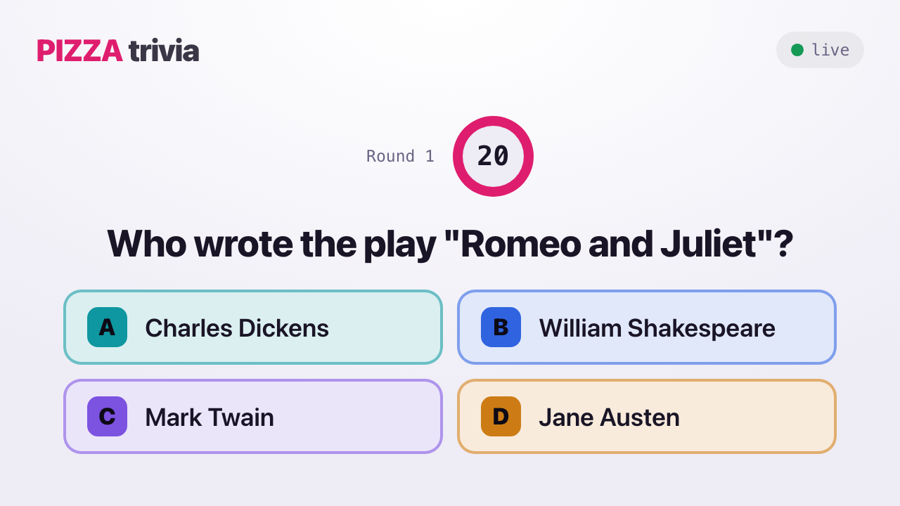
    <figcaption>One platform, plum — trivia, the quiz-show broadcast.</figcaption>
  </figure>
  <figure>
    
    <figcaption>One platform, phosphor — Battleship, fleet command. Same shell, two worlds.</figcaption>
  </figure>

Observability

## The platform can watch itself

Last week's event spine only wrote — a JSONL log that nothing read back. This week the read side arrived
as three derived models over that one write path, with the writers untouched: live counters at `/metrics`
in Prometheus text, permanent daily rollups kept forever behind a 30-day raw horizon, and a five-view
`/admin` console — the third client entry beside host and player, ESLint-fenced so it can't even
type-import a game.

<figure>
  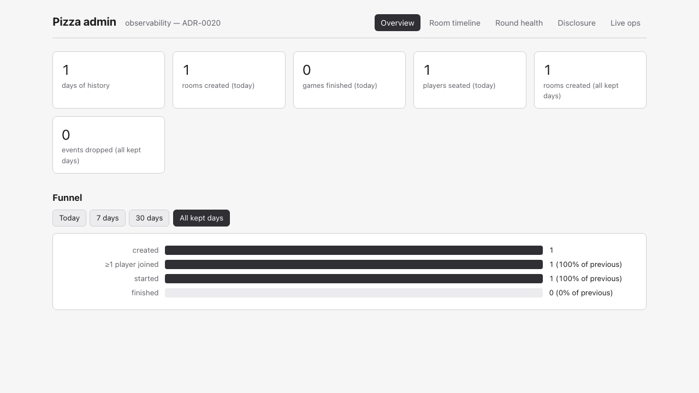
  <figcaption>Overview and the funnel — where do rooms leak: created-never-joined is a QR that didn't scan.</figcaption>
</figure>

The headline is the room timeline — a distributed-trace view of a party game, each round a span coloured
by how it closed, each seat a lane, disclosures marked on the axis. The others answer questions the
product could only guess at before: round health audits the close policy, and the disclosure view finally
makes the pub-round cadence measurable instead of shipped on faith. Live ops updates over the games' own
WebSocket transport — no polling, the console just watches the wire.

  <figure>
    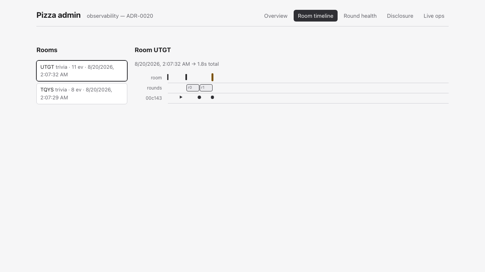
    <figcaption>Room timeline — one game's whole trace on a time axis.</figcaption>
  </figure>
  <figure>
    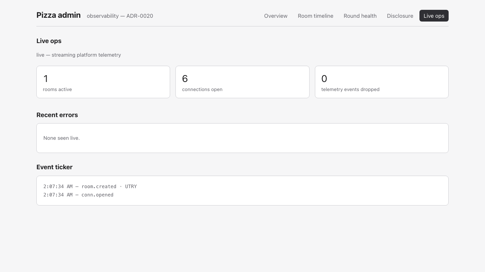
    <figcaption>Live ops — rooms, connections, drops, and errors, live over the wire.</figcaption>
  </figure>

The store is still files: JSONL today, SQLite named as the drop-in swap for the day it earns a native
dependency. The read side shipped as an interface from the first commit, so that day changes no callers —
the same files-over-database move the project keeps making.

Receipts

## Receipts, lightly

A fast week still leaves marks, and the ledger stays honest:

- **The app bound every interface.** A missing host argument on `listen()` served the real host secret in
  plaintext, past the TLS and the auth (#222). The first fix used `??`, which waves an empty-string
  through; review caught it and swapped in `||`, with the test that proves it.
- **One `git add -A` from a leaked secret.** Rotating that secret with `sed -i.bak` left a `.env.bak`
  copy the ignore rule didn't cover (#224). Caught and closed the same day.
- **The reviewer reviewed nothing.** The Claude Review action posted zero comments on the Battleship PR
  across three tries — 52 permission denials, $4.28 spent, a green check and silence — before #249 → #253
  widened its tools and made posting the verdict a stated must.
- **A caps discipline learned the hard way.** GitHub's own infra hung the Playwright install for up to 52
  minutes; neither CI job had set a timeout, so both were exposed to the 6-hour default kill (#243, #245).

The process kept trimming its own bill, too — Monitor's cron went from every 15 minutes to every 6 hours
(~24× fewer unattended job-minutes), and the subagent routing got pinned to a specific model id after the
bare "Opus" alias silently began resolving to a newer, pricier model (#228).

And one bug class finally graduated into a rule. "**Every new stateful phase ships its resync**" is now
line three of the review bar (#164), worded against the round engine's actual trio —
`roundSnapshot` / `standingsSnapshot` / `gameOverSnapshot`. It earned the promotion honestly: #257 found
that the auto-advance dwell between rounds had no resync at all, so a host refresh mid-dwell dropped a
live game back to the pre-game lobby. The same PR that promoted the rule also walked back an over-broad
claim about what survives a restart — the reference implementation doesn't meet it in one mode, so the gap
is named rather than asserted away.

  <figure>
    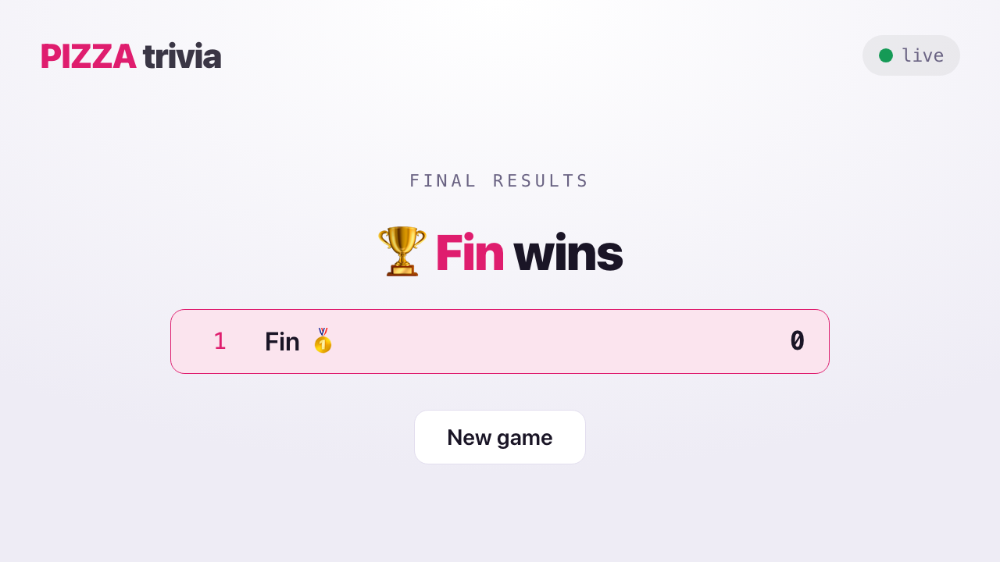
    <figcaption>A finished game survives a host reload — same winner, no dead lobby.</figcaption>
  </figure>
  <figure>
    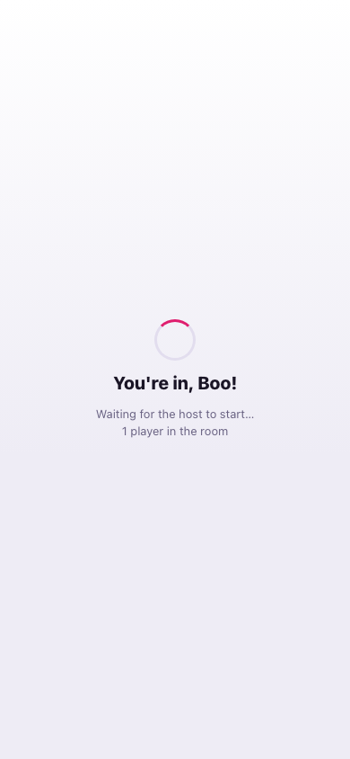
    <figcaption>A player reloads and lands back in the same room, seat intact.</figcaption>
  </figure>

Loose ends

## Still on the bench

Matter-of-fact, tracked by number, in the series tradition:

- **No version tag, still.** `package.json` reads `0.1.0`; the repo has never cut one. Two games are on
  the board and the release ritual has yet to fire once.
- **The bot drives the wire, not the client** (#221). The smoke bot still plays through the protocol, not
  the real browser — untouched this week.
- **Agent hygiene, round two.** The stale parallel-agent worktrees under `.claude/` are correctly ignored
  but still unswept on the record.

Next

## v0.3, still calling in

The tease survives another dispatch: v0.3 is where Claude calls *in* — an MCP server wrapping the question
pool and game stats, with a generate-then-verify pipeline behind it, the platform's first `AIService`
consumer. What changed is that the platform is now actually shaped for a caller like that: two registered
games, typed round rules, per-seat views, and an event spine with a console to watch it all happen.

Two games are playable. The platform can register a second, hide a fleet from the seat beside it, and read
its own history back. It still hasn't cut a release — but this was never the week for that. It was the
week the bench got clear enough to finally start the fun part.

<footer class="article-foot">
  

    Produced with Claude Code from the repository's own history — commits, PR and issue bodies, ADRs,
    review threads, and the playtest notes quoted above — and fact-checked against those sources before
    this page was written. The Pizza repo is private, so artifacts are referenced by number rather than
    linked, as in every dispatch before this one. The test figure is the project's own runner
    (<code>node --test</code> over <code>src/</code>): 627 passing, counted the same way as the 463 it
    grew from. Every screenshot is a local capture; the one lobby frame that showed a real network
    address was left out on purpose.
  

  

    Type: PrintChar21 © Kreative Software, the pixel-exact Apple II ROM face, used unmodified under the
    Kreative Software Relay Fonts Free Use License — the same terms under which the game bundles it. This
    dispatch borrows Battleship's theme for one issue only; the house colors return next week.
  

</footer>
